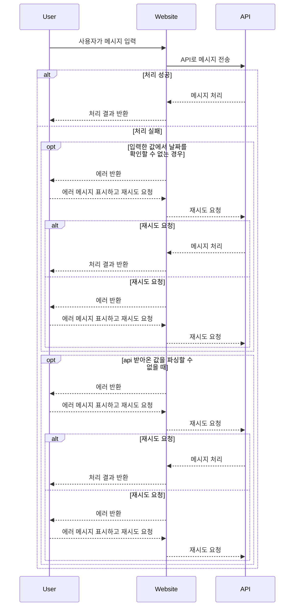

# recommand_tour

* ChatGPT를 이용한 여행 추천 서비스  

<h2>개발환경<h2/>
  
* 개발환경: HTML, CSS, JavaScript
  
<h2>목표<h2/>

* 사용자에게 여행 장소와 기간을 입력받아 여행일정을 추천해주는 간단한 챗봇만들어보기

<h2>사용방법<h2/>

 
* 실행후 여행장소와 여행기간 입력

* 실행 URL: https://seungil1.github.io/recommand_tour/
* github repo: https://github.com/seungil1/recommand_tour

<h2>기능명세<h2/>

