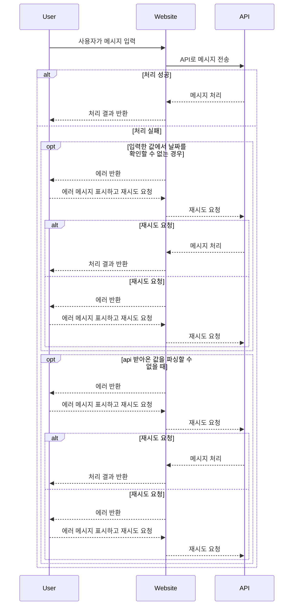
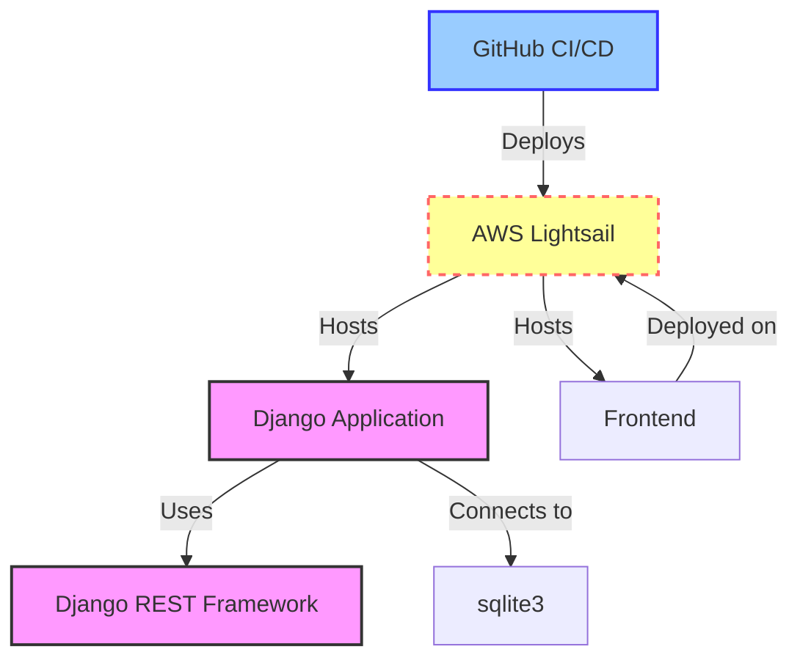

# recommand_tour

* ChatGPT를 이용한 여행 추천 서비스  

### 개발환경
- 개발환경: HTML, CSS, JavaScript

### 목표
- 사용자에게 여행 장소와 기간을 입력받아 여행 일정을 추천해주는 간단한 챗봇 만들어보기

### 사용방법
- 실행 후 여행 장소와 여행 기간 입력
- 실행 URL: [https://seungil1.github.io/recommand_tour/](https://seungil1.github.io/recommand_tour/)

  
- GitHub Repo: [https://github.com/seungil1/recommand_tour](https://github.com/seungil1/recommand_tour)

### 기능명세

