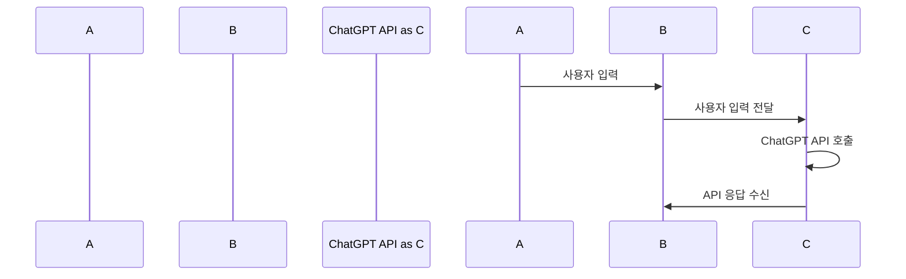

# recommand_tour
#ChatGPT를 이용한 여행 추천 서비스

## 개발환경

* 개발환경: HTML, CSS, JavaScript
  

## 목표

* 사용자에게 여행 장소와 기간을 입력받아 여행일정을 추천해주는 간단한 챗봇만들어보기

## 사용방법

* 실행후 여행장소와 여행기간 입력

## 기능

* 실행 URL: https://seungil1.github.io/recommand_tour/
* github repo: https://github.com/seungil1/recommand_tour
